## gitとは


## クライアント環境構築
### git for windowsをインストール

1. [https://git-for-windows.github.io/](https://git-for-windows.github.io/)からインストーラをダウンロードして実行  
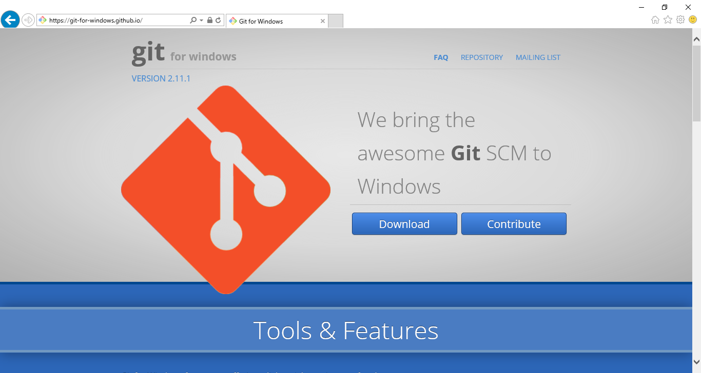  
2. Nextボタン押下  
  
3. Nextボタン押下  
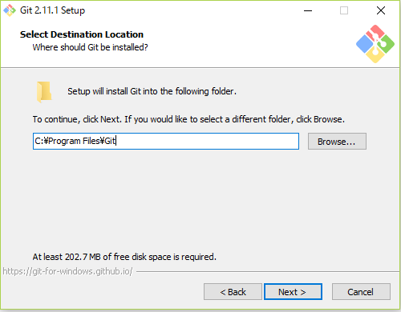  
4. すべてのチェックを外してNextボタン押下  
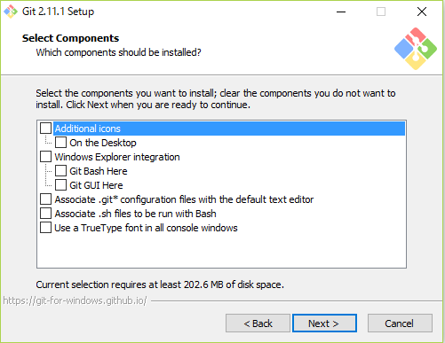  
5. Nextボタン押下  
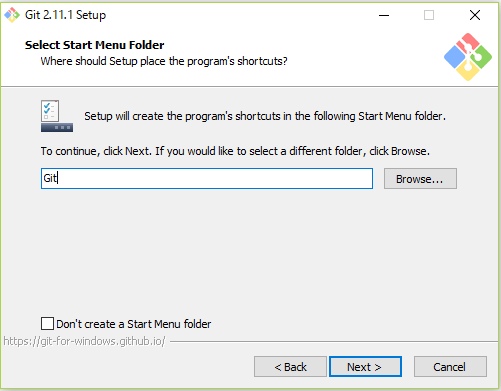  
6. Nextボタン押下  
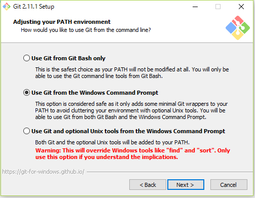  
7. 「Checkout as-is, commit as-is」を選びNextボタン押下  
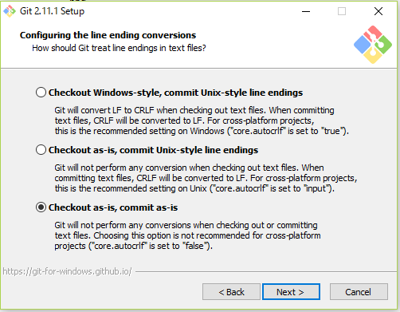  
8. Nextボタン押下  
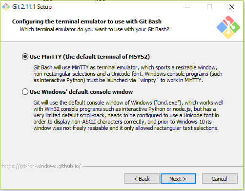  
9. Nextボタン押下  
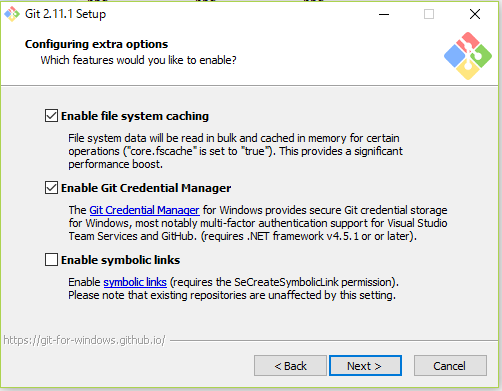  
10. Nextボタン押下  
  
11. インストールが行われます  
12. Finishボタン押下  
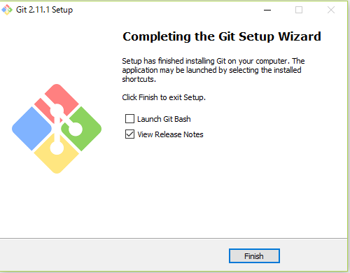  
12. コマンドプロンプトで下記コマンドを実行してgitの初期設定を行う
```
git config --global user.email %UserName%@xxx.jp
git config --global user.name %UserName%
git config --global core.quotepath false
git config --global core.autocrlf false
git config --global push.default upstream
git config --global gui.encoding utf-8
```

### TortoiseGitをインストール

エクスプローラーにgit操作メニューを統合してgitを直感的で操作できるようになります

1. [https://tortoisegit.org/download/](https://tortoisegit.org/download/)からTortoiseGitと、日本語LanguagePackのインストーラをダウンロード  
64bitの環境の場合は64bit用のインストーラを選択してください  
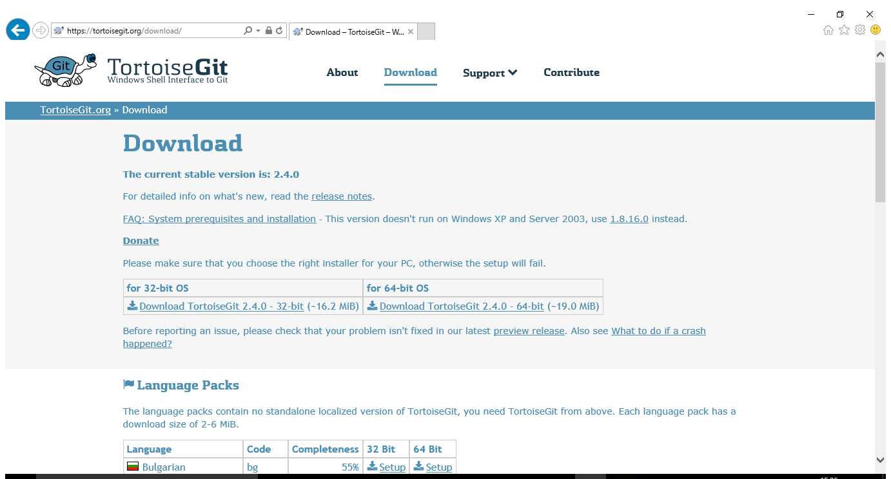  
2. TortoiseGitのインストーラを実行  
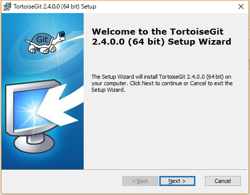  
3. Nextボタン押下  
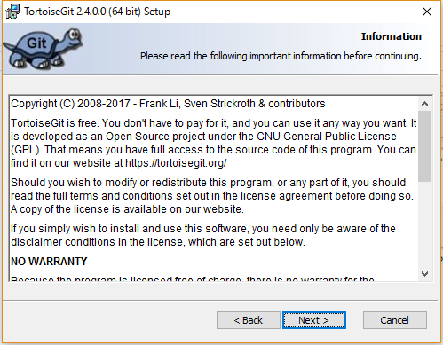  
4. Nextボタン押下  
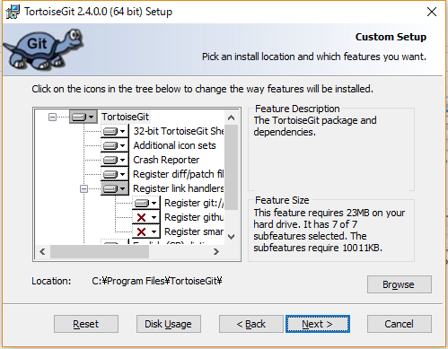  
5. Installボタン押下  
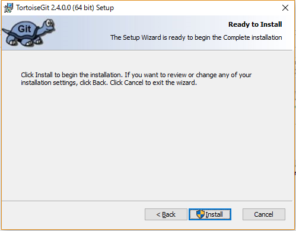  
6. インストールが行われます  
7. 「Run first start wizard」のチェックを外してFinisボタンを押下  
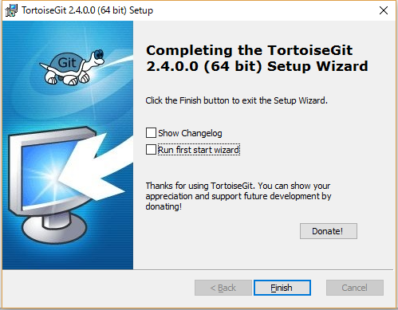  
8. 日本語LanguagePackのインストーラを実行
9. エクスプローラー上で右クリックメニューの「TortoiseGit-Settings」を選択
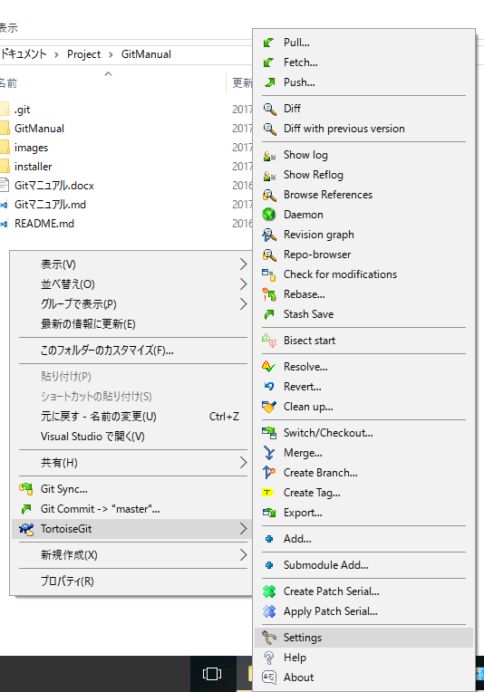  
10. 設定画面のGeneral-Languageで「日本語」を選択してOKボタンを押す
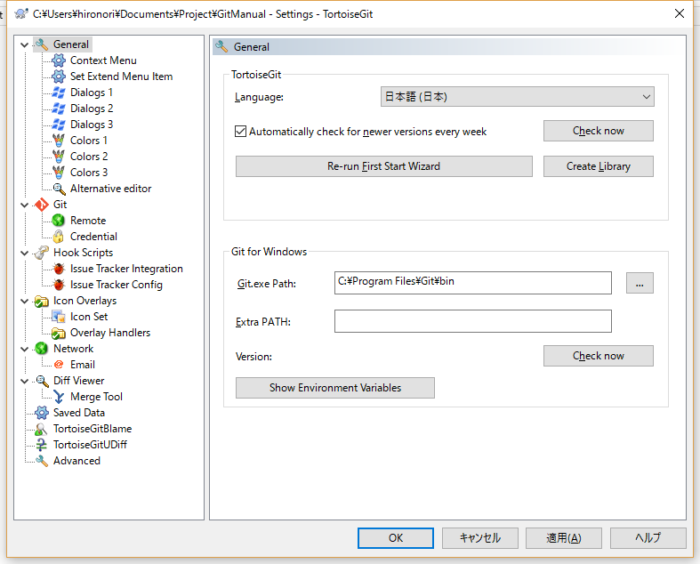  

## 開発開始時に行う操作

### リモートリポジトリを作成

開発メンバーが共有で使用するソースコードを管理する領域を作成します  
この領域をリポジトリと呼びます

- エクスプローラーでファイルサーバーにアクセス
- 「プロジェクト名.git」という名前でフォルダを作成
- 作成したフォルダ内で右クリックメニューの「Git ここにリポジトリを作成」を選択
- 「bareを作成（作業ディレクトリーを作りません）」にチェックを入れてOKボタンを押す

### リモートリポジトリをクローン

開発用PCにローカルリポジトリと作業用フォルダを作成します  
開発メンバー全員が行います

- 開発用PCに作業用のフォルダを作成
- 右クリックメニューの「Gitクローン」を選択
- URLにリモートリポジトリのフォルダパスを入力
- ディレクトリに取得先のローカルPCに作業用のフォルダを入力
- OKボタンを押す
- 作業用フォルダに「.git」というサブフォルダが作成されます  
このフォルダはgitがソース管理するために使用するフォルダなので、削除したり中のファイルを操作してはいけません

## 開発時に行う操作

gitでバージョン管理を行うための基本的な操作方法を説明する
高度な使用方法はここでは説明しません

### 最初のソース追加

ローカルリポジトリにソースコードを反映します
この操作をコミットといいます

- 作業用フォルダにソースコード等を追加します。
- ファイルもしくはフォルダを右クリックして「TortoiseGit-追加」を選択  
- OKボタンを押す
- 追加したフォルダもしくはファイルに＋マークが付きます   
コミットしていないのでこの時点ではローカルリポジトリには反映されていません
- 作業用フォルダ内で右クリックメニューの「Gitコミット」を選択
- メッセージ欄に修正内容を入力
- ファイル一覧に追加したファイルのチェックがONになっていることを確認
- コミットボタンを押す
- 作業用フォルダ内で右クリックメニューの「TortoiseGit-ログを表示」を選択
- コミットした内容が履歴に表示されます
- 追加したファイルが緑のチェックマークに変わります

### ソースの修正等

ソース修正時に使用する基本的な操作を説明します

- ファイルを修正すると緑のチェックマークが赤の！マークに変わります
- 右クリックメニューの「TortoiseGit-削除」でファイルもしくはフォルダを削除できます
- 右クリックメニューの「TortoiseGit-名前の変更」でファイルもしくはフォルダの名前を変更できます
- 右クリックメニューの「TortoiseGit-差分」で変更したファイル一覧が表示されます  
ファイルを選択してダブルクリックすると比較ツールが起動してファイルの変更内容を確認できます
- 右クリックメニューの「TortoiseGit-変更の取り消し」で変更したファイルやフォルダの内容を修正前に戻せます
- 右クリックメニューの「TortoiseGit-クリーンアップ」でバージョン管理外のファイルを削除できます
- 右クリックメニューの「TortoiseGit-無視リストに追加」でバージョン管理しないファイルやフォルダを指定できます  
コンパイルで生成されたファイルなど履歴管理しないファイル等を追加します  
追加するとコミットダイアロや差分比較ダイアログに出なくなります
- 追加時と同じくコミットすると変更した内容がローカルリポジトリに反映されます

### リモートリポジトリとの同期

この時点ではまだ他のメンバーにはソースは共有されていません  
ローカルでの動作確認が終わり共有できる状態になったら本章での操作を行ってください

- 作業用フォルダ内で右クリックメニューの「TortoiseGit-ログを表示」を選択
- 履歴の[master]というマークがローカルリポジトリの最新の履歴です
- 履歴の[orijin/HEAD]というマークがリモートリポジトリ最新の履歴です  
[master]と[orijin/HEAD]の間がリモートリポジトリに反映されていない履歴です
- 作業用フォルダ内で右クリックメニューの「TortoiseGit-プッシュ」を選択すると共有リポジトリに反映されます 
反映後に履歴を確認すると[orijin/HEAD]が一番上に来て[master]と同じ履歴になります
- 作業用フォルダ内で右クリックメニューの「TortoiseGit-プル」を選択すると、他者が共有リポジトリにプッシュしたソースをローカルにマージできます

### リモートリポジトリとの同期できない場合

- プルしていない履歴がある状態でプッシュを行うとエラーが出てプッシュに失敗するので、その場合プルを行ってください
- コミットしていないファイルがあるとプルできません
- 例えば同じファイルの同じ行を他社が修正していた場合プルを行うとそのファイルはマージに失敗します 
マージに失敗したファイルは黄色の！マークがついているので直接ファイルを開いて手動でマージを行います  
マージが終わったファイルを右クリックメニューの「TortoiseGit-競合の解決」を選択
全てのファイルの競合を解決したらコミットしてプッシュしてください

### その他重要な操作

- 作業用フォルダ内で右クリックメニューの「TortoiseGit-エクスポート」でソース一式をzip化できます
- 本番環境にリリースできる状態になった等、履歴に目印を付けい場合はタグを使用します  
作業用フォルダ内で右クリックメニューの「TortoiseGit-タグを作成」から行います
VSSでいうとラベルです

### ブランチ

Ver1.0をリリースした後、Ver2.0リリースの向けて機能追加中にVer1.0に不具合が見つかりました  
Ver1.0に不具合修正を加えたVer1.1をリリースすることになりましたが、最新のソースには作業中のVer2.0の修正が含まれているので修正

### 履歴一覧画面の操作方法

- 履歴を選択するとその履歴のコミットで修正したファイル一覧が表示されます  
ファイルをダブルクリックすると比較ツールが起動してファイルの変更内容を確認できます
- 履歴を右クリックして「作業ツリーと比較」を選択すると作業フォルダと選択した履歴との差分ファイルを確認できます
- 履歴を右クリックして「このコミットの変更を元に戻す」を選択するとその履歴で変更した内容が元に戻ります 
その履歴を無かったことにするのではなく、対象の履歴の変更を相殺するような履歴が自動で生成されます
