## よく使う操作
### 作業フォルダを変更前(前回のコミット)に戻す
1. 右クリックメニューの「TortoiseGit-変更の取り消し」を選択
  
2. 元に戻すファイルを選択してOKボタンを押下  
 

### コミットした変更を元に戻す
指定したコミットを取り消す内容のコミットを実行します

1. 履歴の右クリックメニューの「このコミットの変更を戻す」を選択
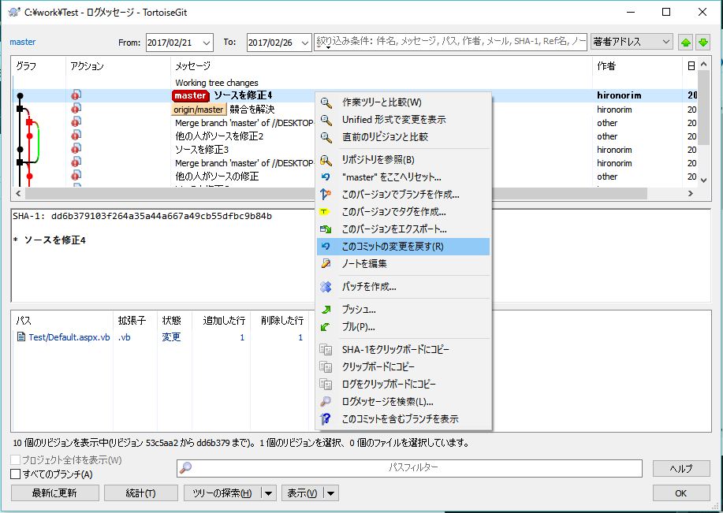
2. コミットを押下
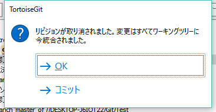

### 無視リストに追加
ソース管理しないファイルやフォルダを指定します  
無視リストに追加すると変更のチェックやコミットダイアログに表示されなくなります

1.ファイルかフォルダを選択して右クリックメニューの「TortoiseGit-無視リストに追加」を選択
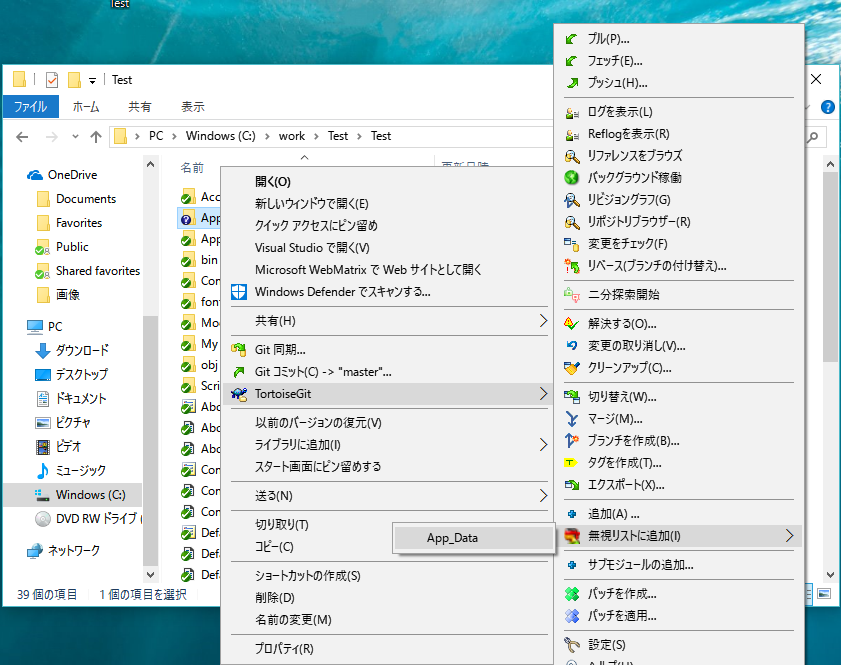  
2.OKボタンを押下  
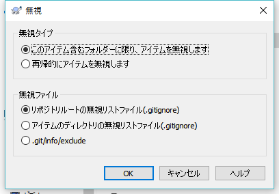  
3.無視リストをコミット  
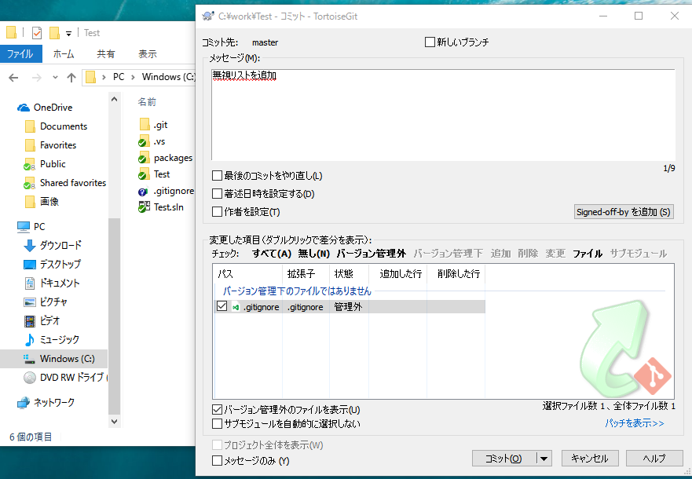  

### ソースをzipファイルでエクスポート
1. 右クリックメニューの「TortoiseGit-エクスポート」を選択
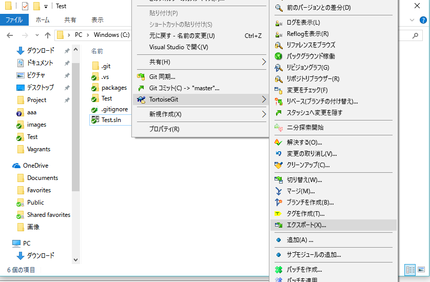 
2. 出力先パスを入力してOKボタンを押下
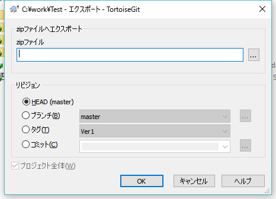 

### コミットにタグを付ける
コミットがリリースなど特別な意味を持つときに設定します

1. 右クリックメニューの「TortoiseGit-タグを作成」を選択
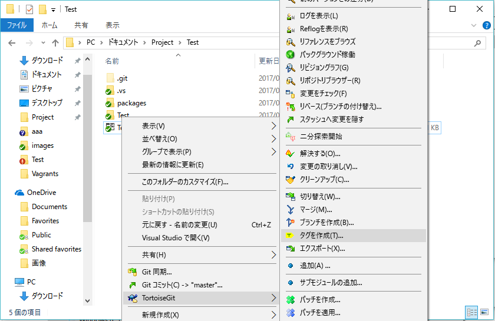 
2. タグ名を入力してOKボタンを押下
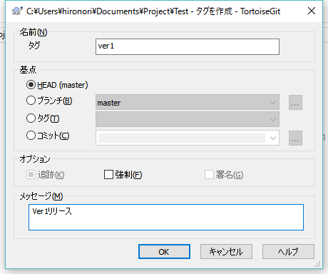 
3. タグを含めるに選択してプッシュ
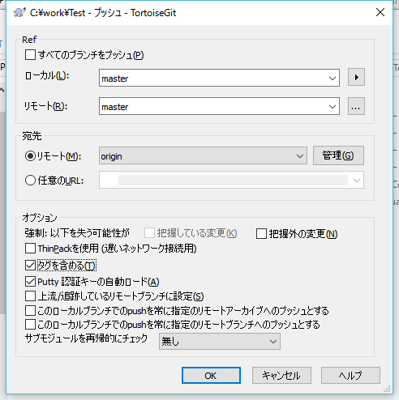 
4. 履歴にタグが追加されました
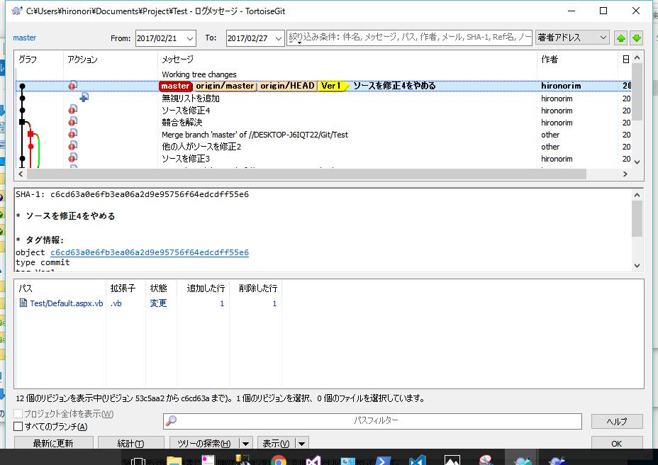 
