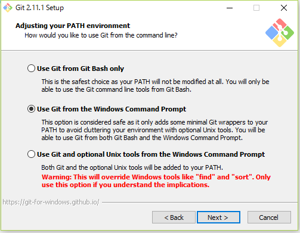
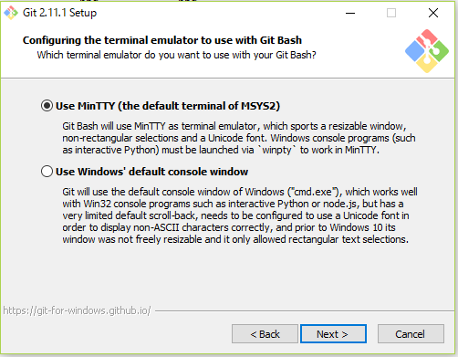
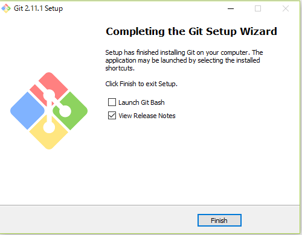
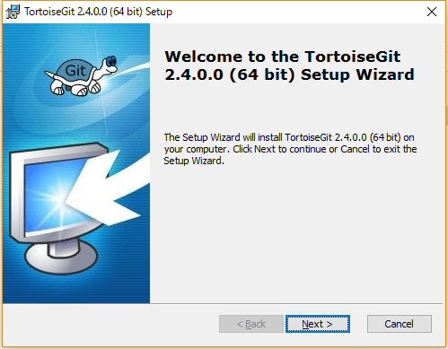
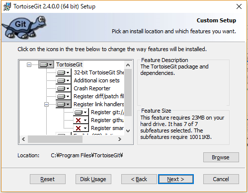
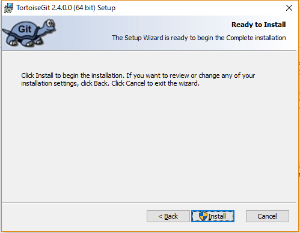
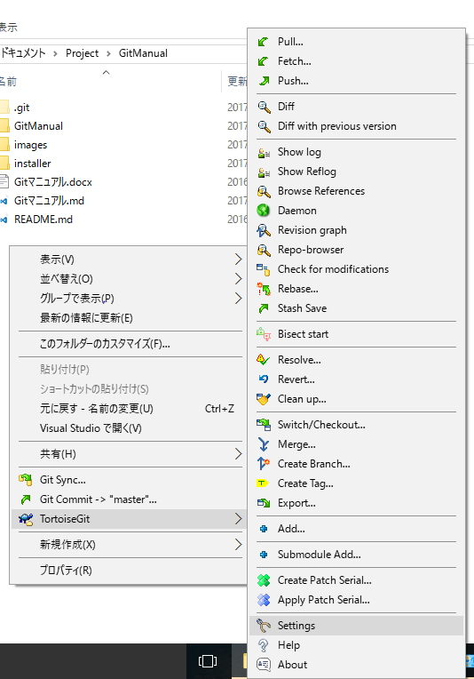
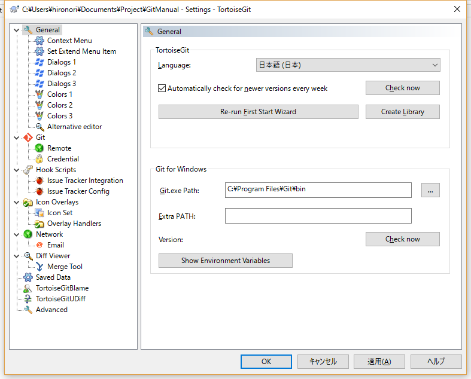

## セットアップ
### git for windowsをインストール

1. [https://git-for-windows.github.io/](https://git-for-windows.github.io/)からインストーラをダウンロードして実行  
  
2. Nextボタン押下  
  
3. Nextボタン押下  
  
4. すべてのチェックを外してNextボタン押下  
  
5. Nextボタン押下  
  
6. Nextボタン押下  
  
7. 「Checkout as-is, commit as-is」を選びNextボタン押下  
  
8. Nextボタン押下  
  
9. Nextボタン押下  
  
10. Nextボタン押下  
  
11. インストールが行われます  
12. Finishボタン押下  
  
12. コマンドプロンプトで下記コマンドを実行してgitの初期設定を行う
```
git config --global user.email %UserName%@xxx.jp
git config --global user.name %UserName%
git config --global core.quotepath false
git config --global core.autocrlf false
git config --global push.default upstream
git config --global gui.encoding utf-8
```

### TortoiseGitをインストール

エクスプローラーにgit操作メニューを統合してgitを直感的で操作できるようになります

1. [https://tortoisegit.org/download/](https://tortoisegit.org/download/)からTortoiseGitと、日本語LanguagePackのインストーラをダウンロード  
64bitの環境の場合は64bit用のインストーラを選択してください  
  
2. TortoiseGitのインストーラを実行  
  
3. Nextボタン押下  
  
4. Nextボタン押下  
  
5. Installボタン押下  
  
6. インストールが行われます  
7. 「Run first start wizard」のチェックを外してFinisボタンを押下  
  
8. 日本語LanguagePackのインストーラを実行
9. エクスプローラー上で右クリックメニューの「TortoiseGit-Settings」を選択
  
10. 設定画面のGeneral-Languageで「日本語」を選択してOKボタンを押す
  
