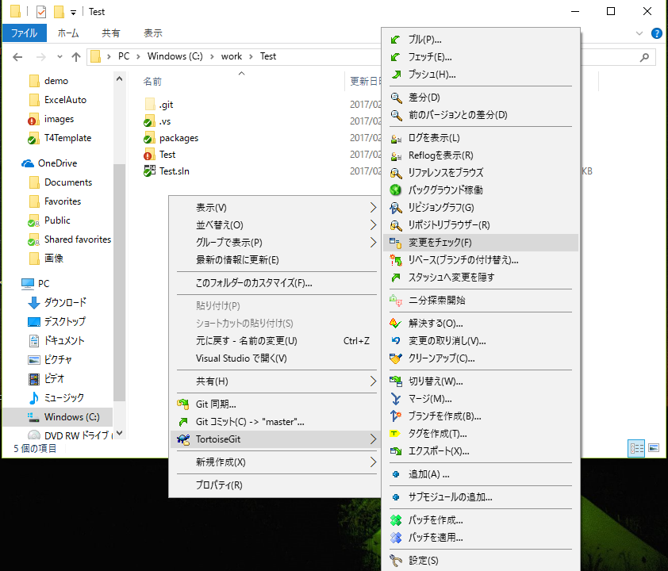
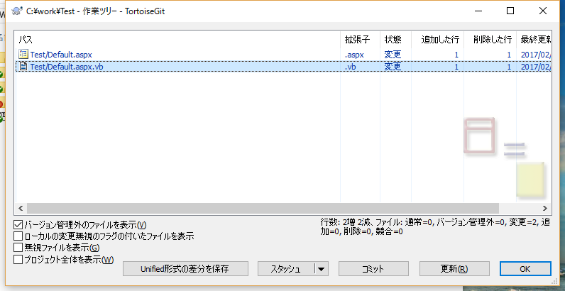
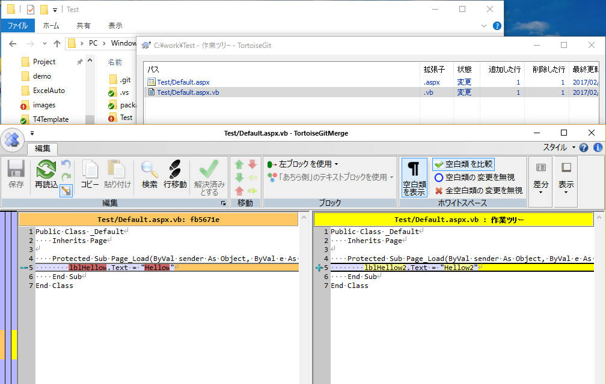
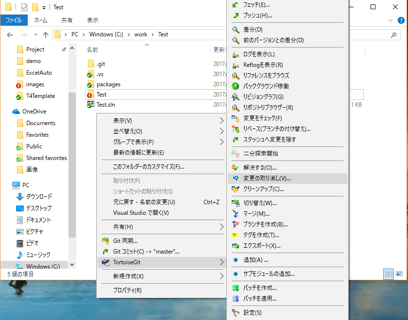
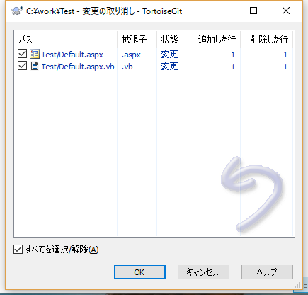

### 変更点の確認
1. 右クリックメニューの「TortoiseGit-変更のチェック」で変更したファイル一覧が表示されます  
 
 
2. ファイルを選択してダブルクリックすると比較ツールが起動してファイルの変更内容を確認できます
 

### 変更の取り消し
- 右クリックメニューの「TortoiseGit-変更の取り消し」で変更したファイルやフォルダの内容を修正前に戻せます
 
 

### リポジトリの履歴
- 右クリックメニューの「TortoiseGit-クリーンアップ」でバージョン管理外のファイルを削除できます
- 右クリックメニューの「TortoiseGit-無視リストに追加」でバージョン管理しないファイルやフォルダを指定できます  
コンパイルで生成されたファイルなど履歴管理しないファイル等を追加します  
追加するとコミットダイアロや差分比較ダイアログに出なくなります
- 追加時と同じくコミットすると変更した内容がローカルリポジトリに反映されます
