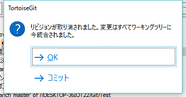
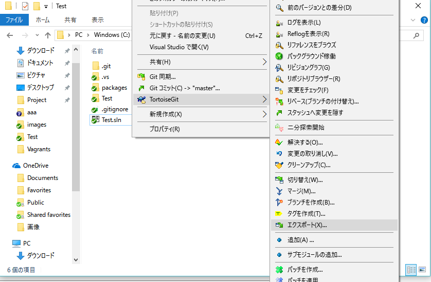
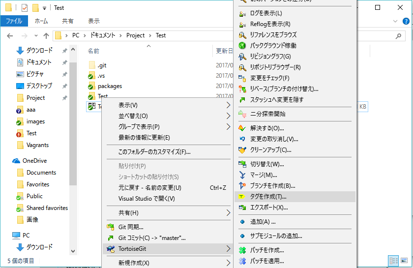
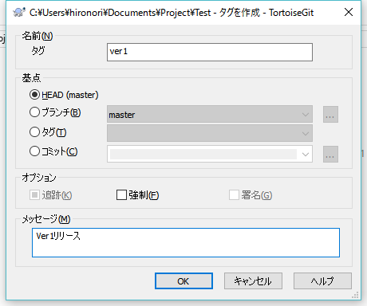
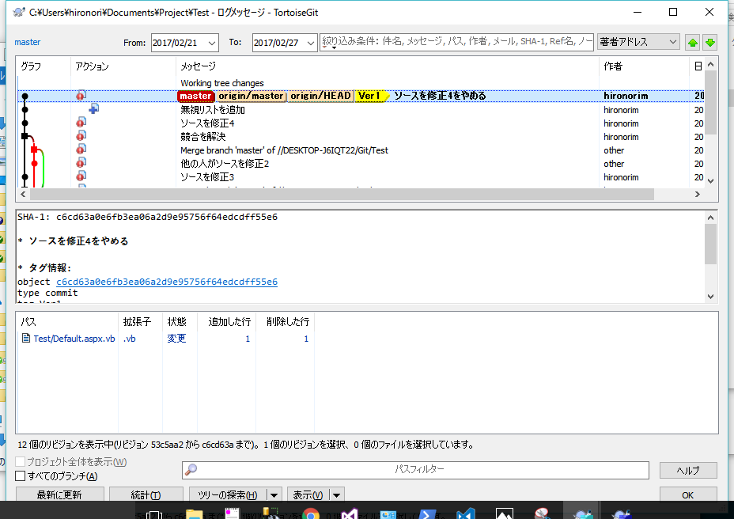

## ソースの修正2

### 変更の取り消し
作業フォルダのファイルを修正前(前回のコミット)に戻します。

1. 右クリックメニューの「TortoiseGit-変更の取り消し」
  
2. 元に戻すファイルを選択してOKボタンを押下  
 

### コミットした変更を元に戻す
1. 履歴の右クリックメニューの「このコミットの変更を戻す」

2. コミットを選択

### 無視リストに追加
ビルドで生成したファイルやデータなどソース管理しないファイルやフォルダを指定します
無視リストに追加すると変更のチェックやコミットダイアログに表示されなくなります

1.ファイルかフォルダを選択して右クリックメニューの「TortoiseGit-無視リストに追加」  
  
2.OKボタンを押下  
  
3.無視リストをコミット  
  

### ソースをzipファイルでエクスポート
1. 右クリックメニューの「TortoiseGit-エクスポート」
 
2. OKボタンを押下
 

### タグを付ける

1. 右クリックメニューの「TortoiseGit-タグを作成」
 
2. タグ名を入力してOKボタンを押下
 
3. タグを含めるに選択してプッシュ
 
4. 履歴にタグが追加されました
 
