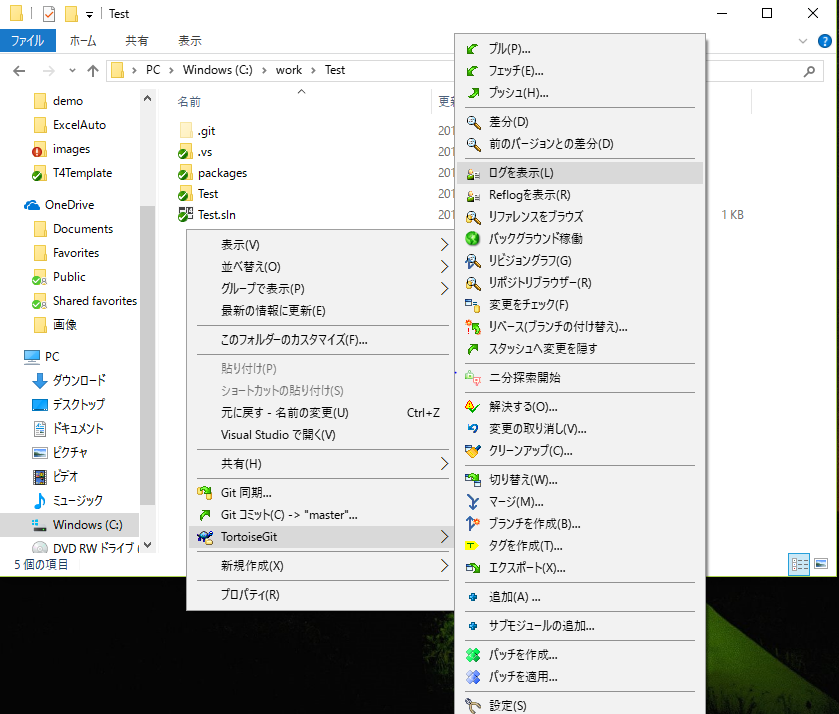
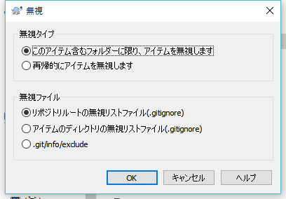

## ソースの修正2
### リポジトリの履歴
今までコミットした履歴を表示します  

1. 右クリックメニューの「TortoiseGit-ログを表示」  
ファイルを選択して「TortoiseGit-ログを表示」すればファイル単位の履歴も表示できます
 
2. 上の一覧が履歴で、下の一覧は選択した履歴の変更したファイル一覧です  
ファイルを選択してダブルクリックすると変更したファイルの差分を確認できます。  
  

### 変更点の確認
前回のコミットと作業フォルダの差分を確認します  

1. 右クリックメニューの「TortoiseGit-変更のチェック」 
 
2. 変更のあったファイル一覧が表示されます
 
3. ファイルを選択してダブルクリックすると比較ツールが起動してファイルの変更内容を確認できます
 

### 変更の取り消し
作業フォルダのファイルを修正前(前回のコミット)に戻します。

1. 右クリックメニューの「TortoiseGit-変更の取り消し」
  
2. 元に戻すファイルを選択してOKボタンを押下  
 

### 無視リストに追加
ビルドで生成したファイルやデータなどソース管理しないファイルやフォルダを指定します
無視リストに追加すると変更のチェックやコミットダイアログに表示されなくなります

1.ファイルかフォルダを選択して右クリックメニューの「TortoiseGit-無視リストに追加」  
  
2.OKボタンを押下  
  
3.無視リストをコミット  
  

