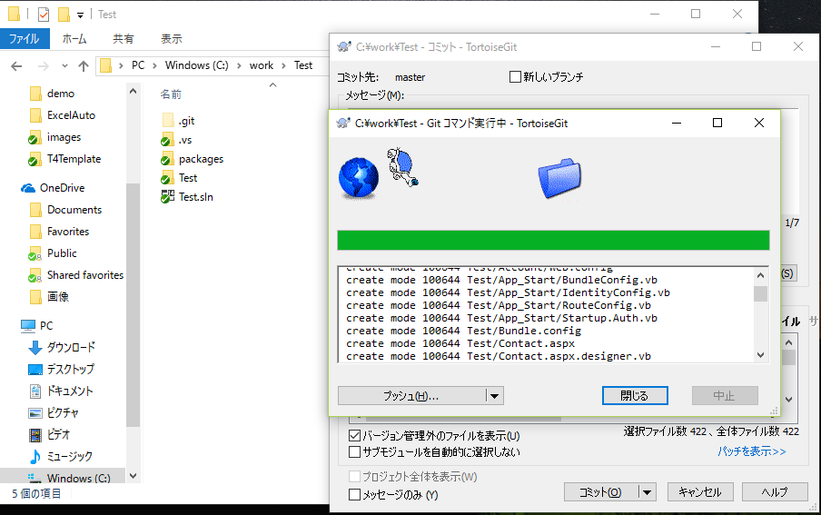
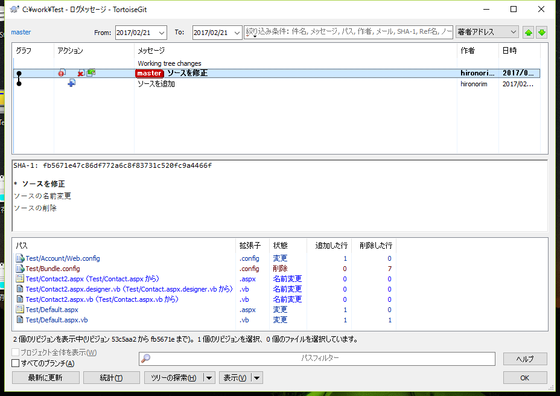
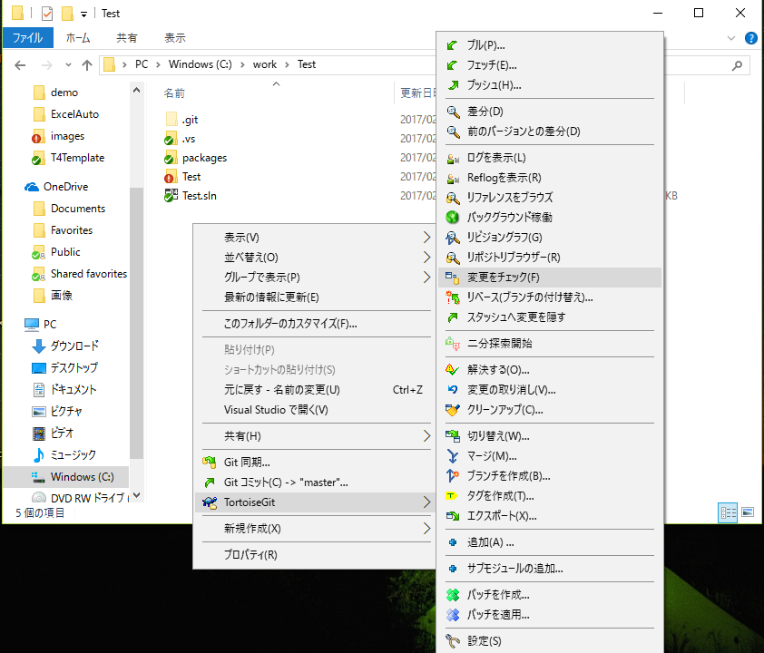

## ソース追加と修正
### 最初のソース追加
1. 作業用フォルダにソースコード等を追加します。
2. ファイルもしくはフォルダを右クリックして「TortoiseGit-追加」を選択  
  
3. OKボタンを押下  
追加したファイルに＋マークが付きます  
コミットするまではローカルリポジトリには反映されません  
  
4. 作業用フォルダ内で右クリックメニューの「Gitコミット」を選択
  
5. メッセージ欄に修正内容を入力してコミットボタンを押下  
  
6. 追加したファイルが緑のチェックマークに変わります  
  

### ソースの修正
1. ファイルを修正すると緑のチェックマークが赤の！マークに変わります  
  
2. ソース管理されているファイルの名前変更や削除はファイルを右クリックのTortoiseGitメニューから行います  
名前変更と削除もコミットするまではローカルリポジトリには反映されません
 
3. コミットします  
 
4. 変更されたソースは緑のチェックマークに変わります
 

### コミットした履歴の確認
1. 右クリックメニューの「TortoiseGit-ログを表示」を選択  
ファイルを選択してログを表示をすればファイル単位の履歴も表示できます
 
2. 上の一覧が履歴で、下の一覧は選択した履歴の変更したファイル一覧です  
ファイルを選択してダブルクリックすると変更したファイルの差分を確認できます  
  

### 前回のコミットとの差分を確認
1. 右クリックメニューの「TortoiseGit-変更のチェック」を選択
 
2. 変更のあったファイル一覧が表示されます
 
3. ファイルを選択してダブルクリックすると比較ツールが起動してファイルの変更内容を確認できます
 
