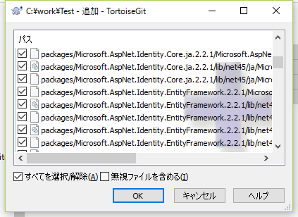
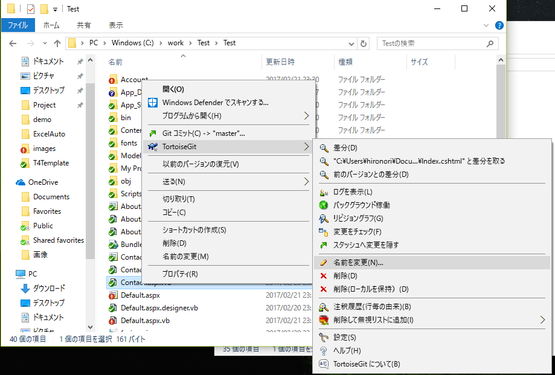
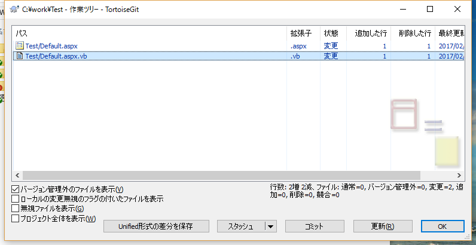

## ソース追加と修正
### 最初のソース追加

ローカルリポジトリにソースコードを反映します
この操作をコミットといいます

1. 作業用フォルダにソースコード等を追加します。
2. ファイルもしくはフォルダを右クリックして「TortoiseGit-追加」を選択  
  
3. OKボタンを押す  
追加したフォルダもしくはファイルに＋マークが付きます  
コミットしていないのでこの時点ではローカルリポジトリには反映されていません  
  
4. 作業用フォルダ内で右クリックメニューの「Gitコミット」を選択
  
5. メッセージ欄に修正内容を入力してコミットボタンを押す  
  
6. 追加したファイルが緑のチェックマークに変わります  
  

### ソースの修正

ソース修正時に使用する基本的な操作を説明します

1. ファイルを修正すると緑のチェックマークが赤の！マークに変わります  
  
2. ソース管理されているファイルの名前変更や削除はファイルを右クリックのTortoiseGitメニューから行います  
名前変更と削除もコミットするまではソース管理には反映されません
 
3. 追加と同じくコミットするとソース管理に反映されます
 
4. 変更されたソースは緑のチェックマークに変わります
 

### 履歴の確認
今までコミットした履歴を表示します  

1. 右クリックメニューの「TortoiseGit-ログを表示」  
ファイルを選択して「TortoiseGit-ログを表示」すればファイル単位の履歴も表示できます
 
2. 上の一覧が履歴で、下の一覧は選択した履歴の変更したファイル一覧です  
ファイルを選択してダブルクリックすると変更したファイルの差分を確認できます。  
  

### 変更点の確認
前回のコミットと作業フォルダの差分を確認します  

1. 右クリックメニューの「TortoiseGit-変更のチェック」 
 
2. 変更のあったファイル一覧が表示されます
 
3. ファイルを選択してダブルクリックすると比較ツールが起動してファイルの変更内容を確認できます
 
