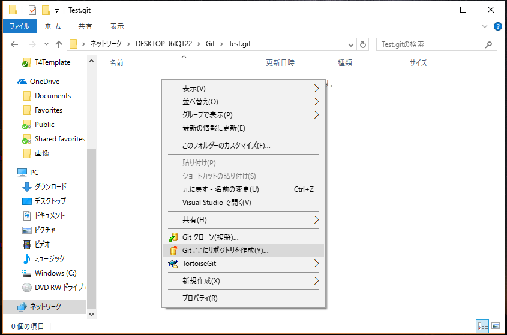
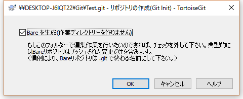
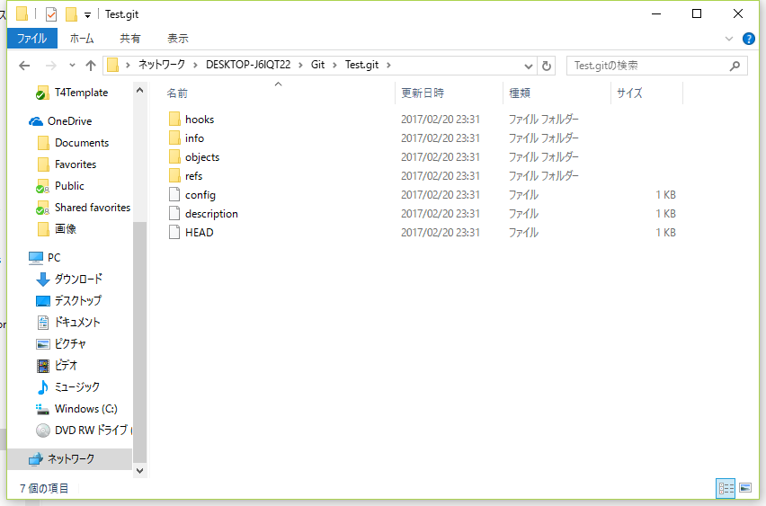
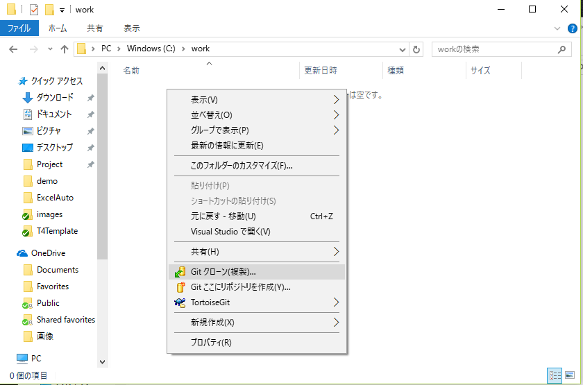
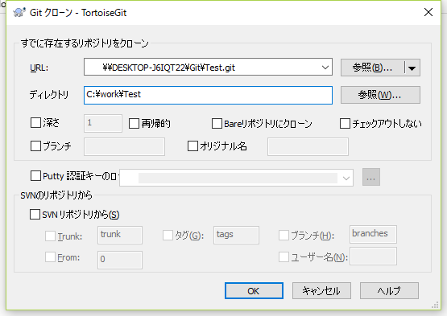
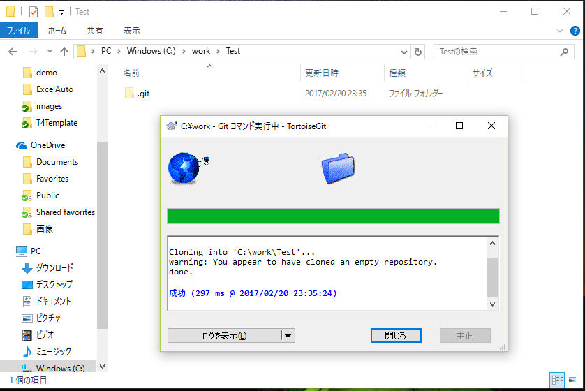

## リポジトリ作成

### リモートリポジトリを作成

開発メンバーが共有で使用するソースコードを管理する領域を作成します  
この領域をリポジトリと呼びます  

1. エクスプローラーでファイルサーバーにアクセス
2. 「プロジェクト名.git」という名前のフォルダを作成
3. 作成したフォルダ内で右クリックメニューの「Git ここにリポジトリを作成」を選択
  
4. 「bareを作成（作業ディレクトリーを作りません）」にチェックを入れてOKボタンを押下
  
5. リモートリポジトリが作成されます
  

### リモートリポジトリをクローン

開発用PCにローカルリポジトリと作業用フォルダを作成します  
開発メンバー全員が行います

1. 右クリックメニューの「Gitクローン(複製)」を選択
  
2. URLにリモートリポジトリのフォルダパス、ディレクトリにローカルPCの作業用フォルダパスを入力しOKボタンを押下
  
3. ローカルリポジトリと作業用フォルダを作成されます。  
「.git」というフォルダはソース管理のために使用するフォルダなので削除したり中のファイルを操作してはいけません
  
