## リモートリポジトリとの同期
### ローカルリポジトリをリモートリポジトリへ同期
この時点ではまだ他のメンバーにはソースは共有されていません  
プッシュを行ってリモートリポジトリへ同期を行います

1. 右クリックメニューの「TortoiseGit-プッシュ」を選択  
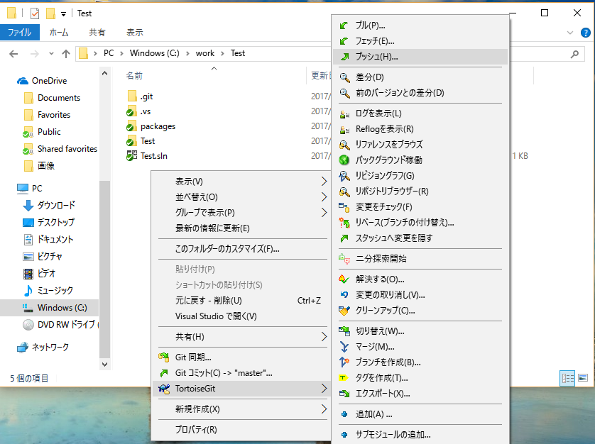  
2. OKボタンを押下  
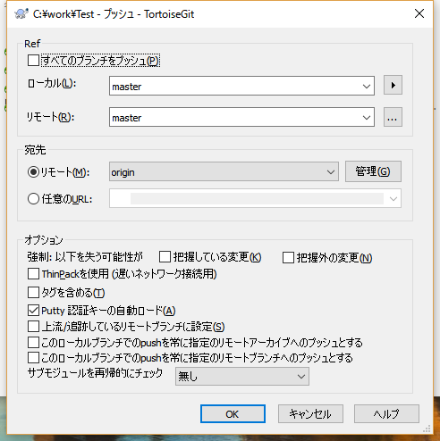  
3. プッシュが終わりました  
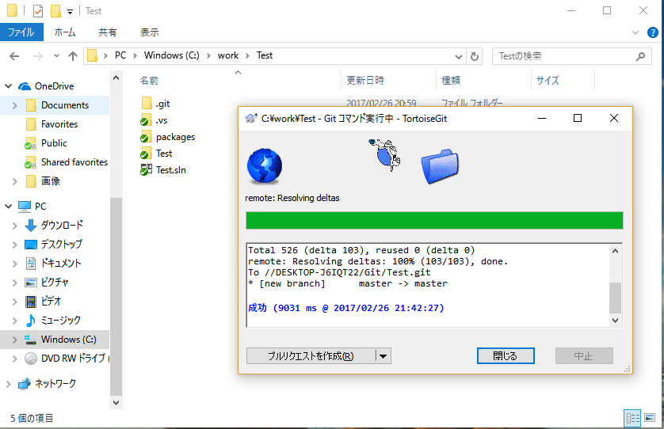  
4. 履歴の[master]がローカルリポジトリの最新、[orijin/master]がリモートリポジトリ最新の履歴です  
プッシュしたのでローカルもリモートも同じ履歴を指しています  
  

### リモートリポジトリをローカルポジトリへ同期
他の開発者がリモートリポジトリへプッシュしたソースをローカルリポジトリに同期します  

1. 右クリックメニュー「TortoiseGit-プル」を選択  
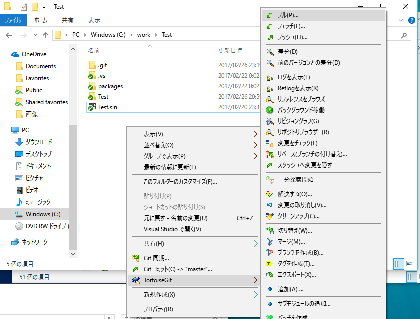  
2. OKボタンを押下  
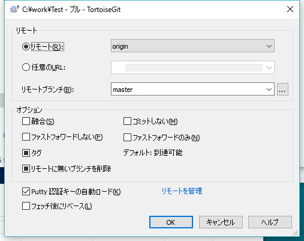  
3. プルが終わりました。  
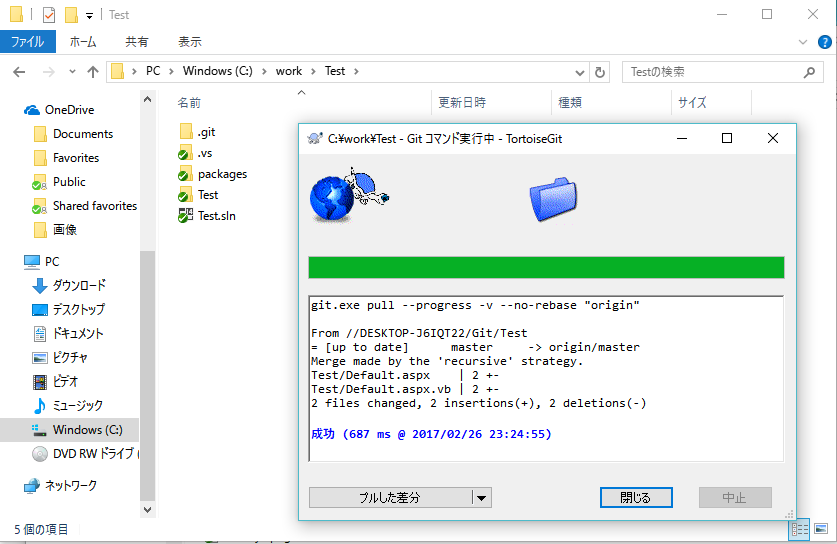  

### プッシュに失敗する場合
プルしていない履歴がある状態でプッシュを行うとエラーが出て失敗します  
プルでローカルに同期した後にプッシュを行ってください
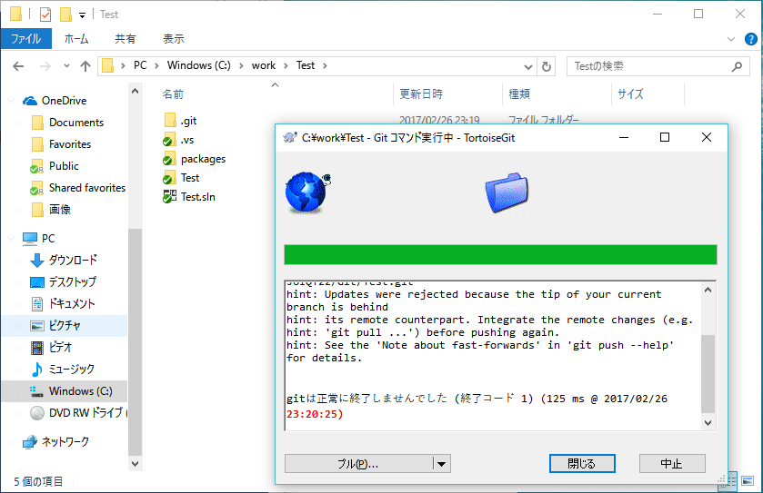  

### 競合の解決
1. ファイルの同じ行を他者が修正してプッシュしていた場合にプルを行うと、そのファイルはマージに失敗してファイルに！マークが付きます  
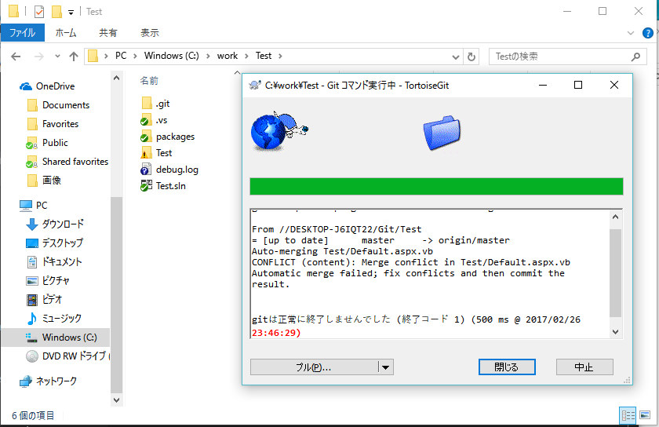  
2. マージに失敗した行は以下のようになっています  
6行目がローカルでの修正内容、8行目がリモートの修正内容です  
手動で修正を行います 
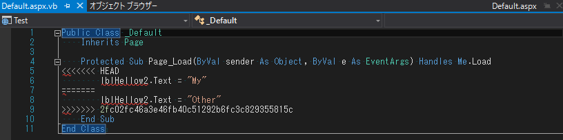  
3. 修正が終わったファイルは右クリックメニューの「TortoiseGit-解決する」を選択  
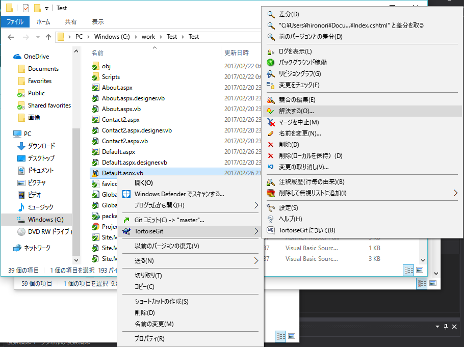  
4. 全てのファイルの競合を解決したらコミットしてプッシュ  

### リモートリポジトリとの差分を比較
1. 右クリックメニュー「TortoiseGit-フェッチ」を選択  
フェッチを行うとリモートリポジトリの履歴が取得されます  
プルと違い差分はローカルのソースにはマージされません  
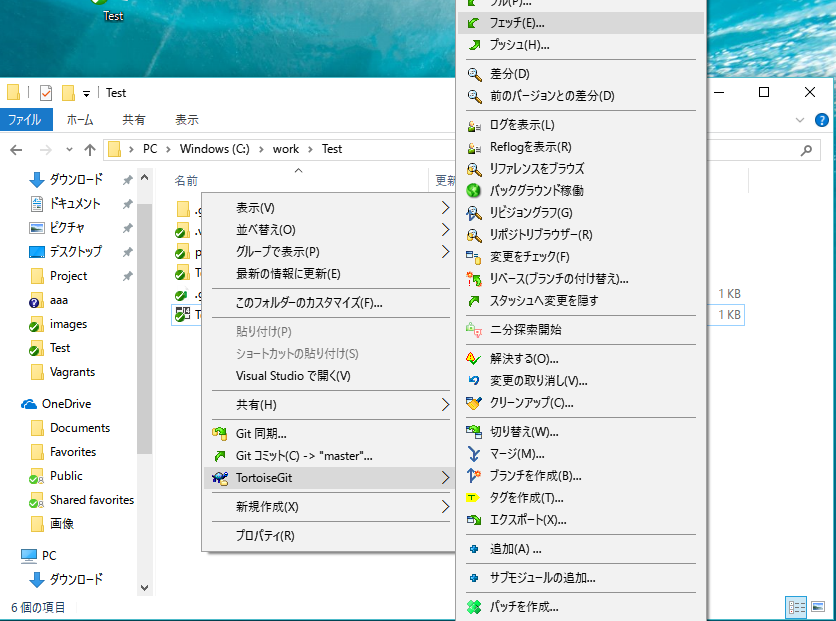
2. OKボタンを押下  
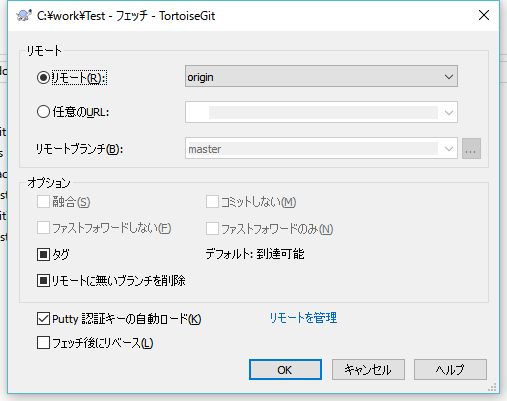
3. リポジトリのログを表示し左上の「master」をクリック  
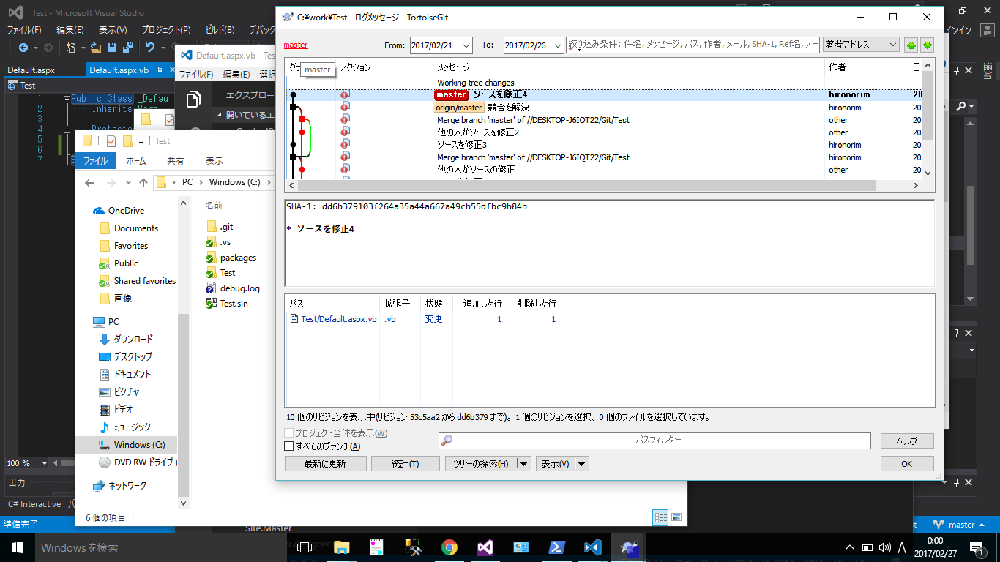
4. 「remote/orijin/master」を右クリックし「作業ツリーと比較」を選択  
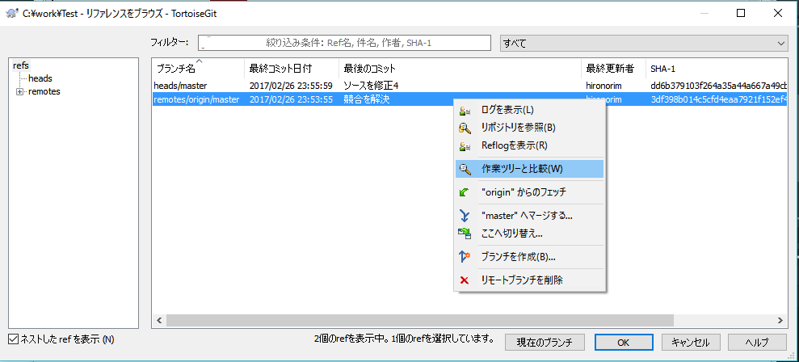
5. 差分ファイル一覧が表示されます  
ファイルを選択してダブルクリックすると差分比較ツールが起動してファイルの差分が比較できます  
「4.」の右クリックメニューで「ログの表示」を選択するとリモートリポジトリの履歴を表示できます
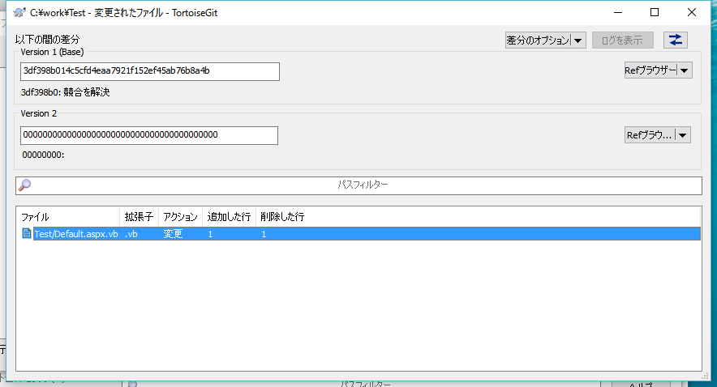

