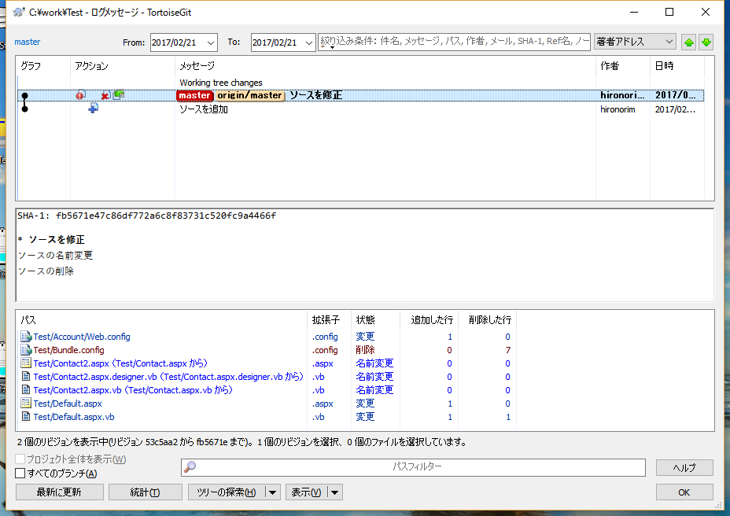

###リモートリポジトリとの同期

##リモートリポジトリへソースを同期
この時点ではまだ他のメンバーにはソースは共有されていません  
ローカルでの動作確認が終わり共有できる状態になったら本章での操作を行ってください

[master]と[orijin/HEAD]の間がリモートリポジトリに反映されていない履歴です
1. 右クリックメニューの「TortoiseGit-プッシュ」を選択
  
2. OKボタンを押下
  
3. プッシュが終わりました。
  
4. 履歴の[master]がローカルリポジトリの最新、[orijin/master]がリモートリポジトリ最新の履歴です  
プッシュしたのでローカルもリモートも同じ履歴を指しています  
  

反映後に履歴を確認すると[orijin/HEAD]が一番上に来て[master]と同じ履歴になります
- 作業用フォルダ内で右クリックメニューの「TortoiseGit-プル」を選択すると、他者が共有リポジトリにプッシュしたソースをローカルにマージできます

## リモートリポジトリとの同期できない場合

- プルしていない履歴がある状態でプッシュを行うとエラーが出てプッシュに失敗するので、その場合プルを行ってください
- コミットしていないファイルがあるとプルできません
- 例えば同じファイルの同じ行を他社が修正していた場合プルを行うとそのファイルはマージに失敗します 
マージに失敗したファイルは黄色の！マークがついているので直接ファイルを開いて手動でマージを行います  
マージが終わったファイルを右クリックメニューの「TortoiseGit-競合の解決」を選択
全てのファイルの競合を解決したらコミットしてプッシュしてください
