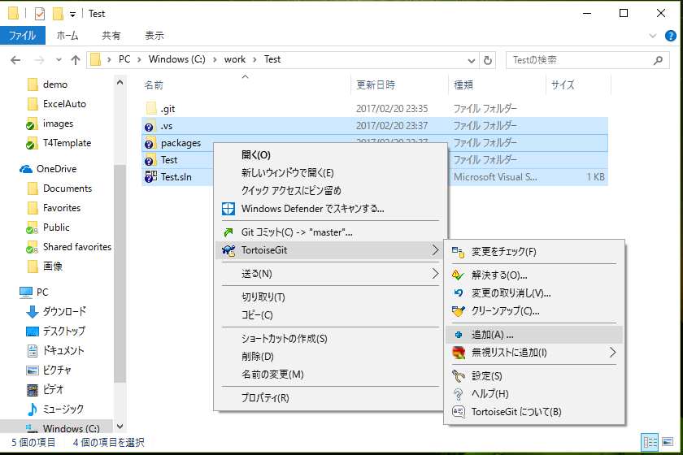
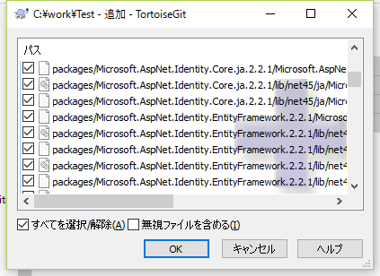
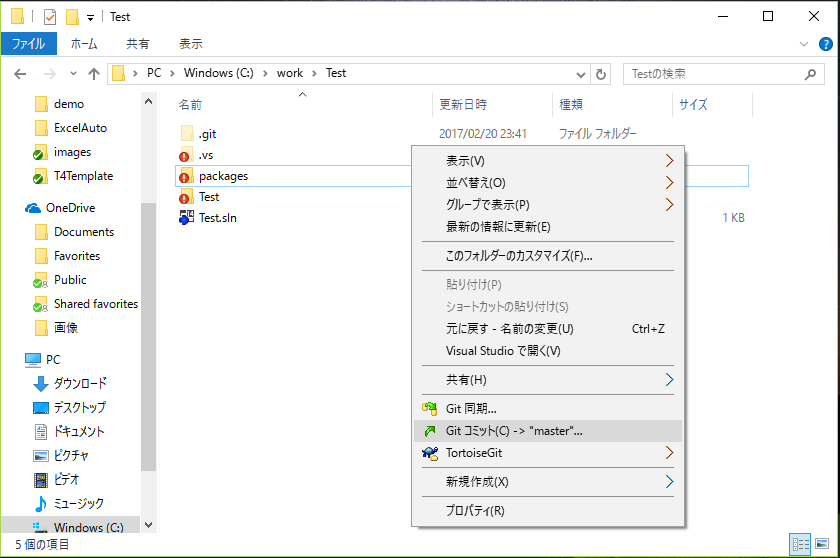
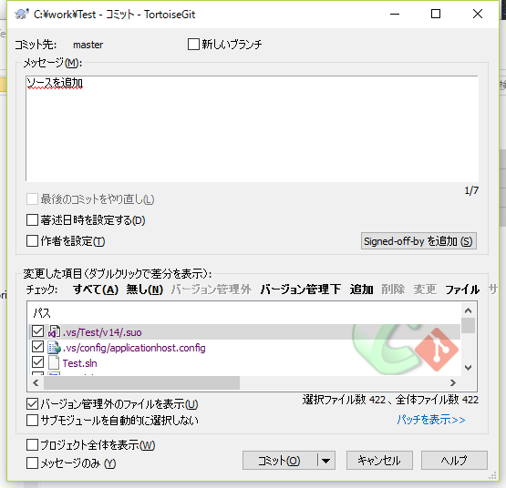
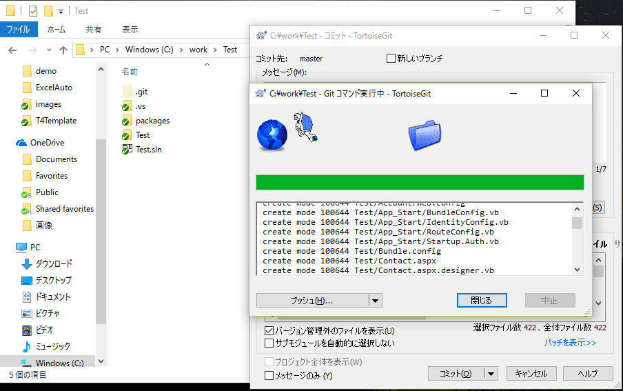

### 最初のソース追加

ローカルリポジトリにソースコードを反映します
この操作をコミットといいます

1. 作業用フォルダにソースコード等を追加します。
2. ファイルもしくはフォルダを右クリックして「TortoiseGit-追加」を選択  
  
3. OKボタンを押す  
追加したフォルダもしくはファイルに＋マークが付きます  
コミットしていないのでこの時点ではローカルリポジトリには反映されていません  
  
4. 作業用フォルダ内で右クリックメニューの「Gitコミット」を選択
  
5. メッセージ欄に修正内容を入力してコミットボタンを押す  
  
6. 追加したファイルが緑のチェックマークに変わります  
  
